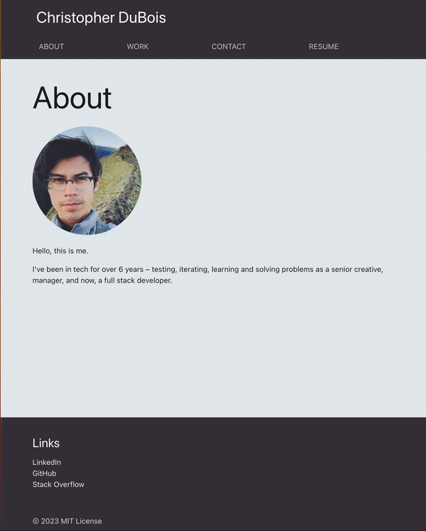

# React Portfolio

## Description

A developer portfolio made using React and Materialize. It showcases past projects that I'm proud as well as being a sample of my skills in itself. This provides me with a location to add future work to display my accomplishments as a developer.

## Usage

Visit the deployed GitHub page here:
[link](link url)

Here is a gif of the deployed site:

## License

Under MIT license. View documentation in repo.
